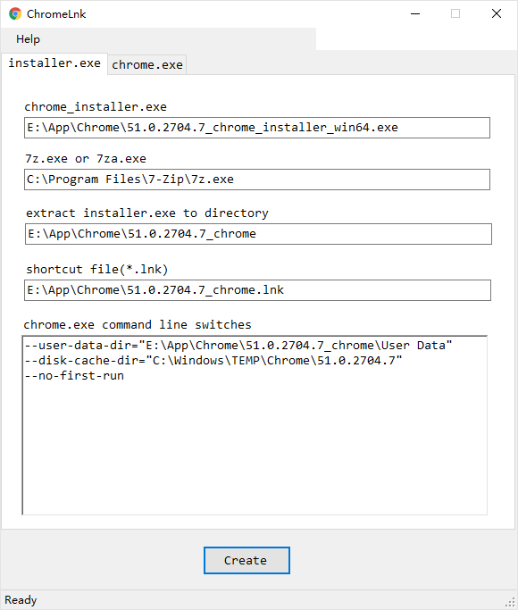
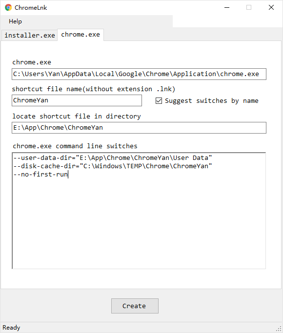

# ChromeLnk

> A simple utility that helps you create Google Chrome shortcut file.

## Usage

Requirements:

- [.NET Framework 4.6.1](https://www.microsoft.com/en-us/download/details.aspx?id=49982),
    App is compiled for this version
- [7-Zip](http://www.7-zip.org/download.html),
    used to extract installer.exe
- Chrome installer.exe, notice its name should contain version,
    e.g. "51.0.2704.7_chrome_installer_win64.exe"

Drag the installer.exe onto the App window, App will extract the installer.exe
and create a shortcut file.

Drag the shortcut file onto the App window, then you can change the shortcut file
or create another shortcut file.

## License

MIT (c) Ivan Yan
