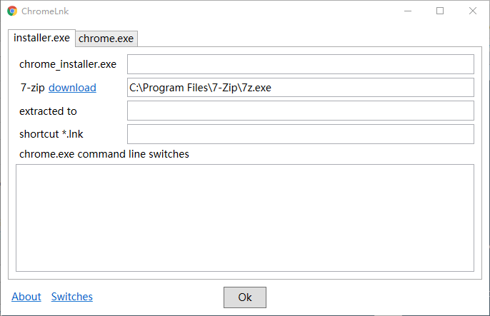

# ChromeLnk

WPF 小程序，为 chrome.exe 创建 shortcut(`*.lnk` 文件)。chrome.exe 来自

- 解压 Chrome 安装程序 installer.exe
- 已安装的 Chrome

在 shortcut 中指定 Chrome 命令行参数，可以使用多个版本的 Chrome，便于测试。

[Download](https://pan.baidu.com/s/1miqIlO8)

## License

MIT (c) Ivan Yan
